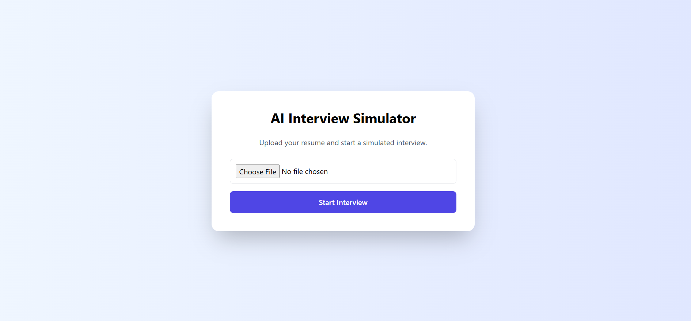
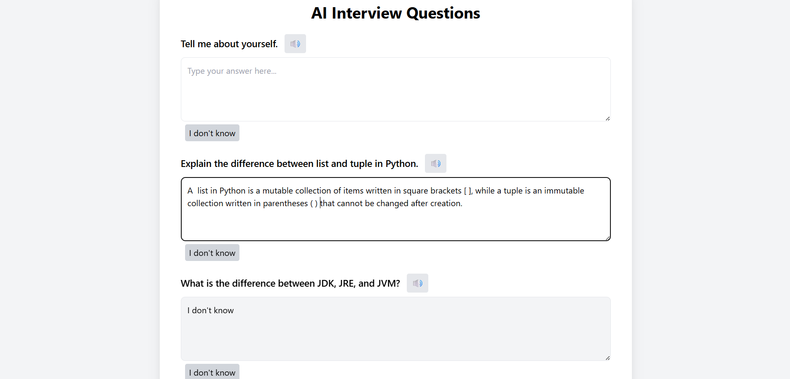
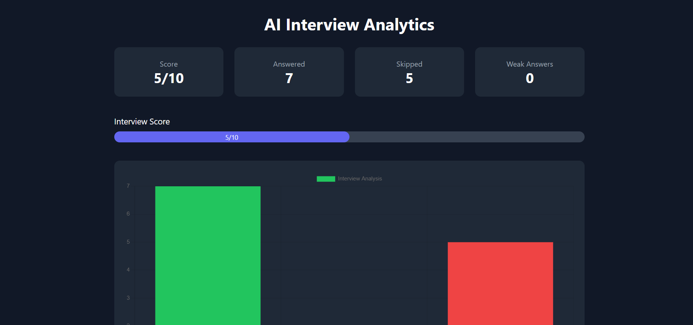
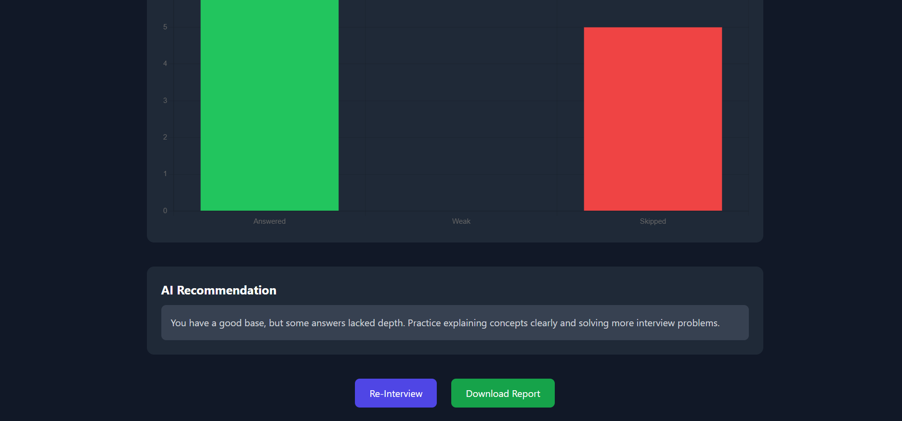

# AI Interview Simulator

An AI-powered interview practice platform that analyzes a candidate's resume, generates interview questions, and evaluates answers to provide performance insights.

This project simulates a real interview experience and provides analytics and recommendations based on user responses.

---

## Features

- Resume upload and automatic skill extraction
- Resume validation (minimum 5 skills required)
- AI-generated interview questions based on skills
- Text-to-speech question playback
- Answer submission interface
- AI-based answer evaluation
- Interview analytics dashboard
- Progress score visualization
- Downloadable interview report
- Re-interview option

---

## Technology Stack

Backend  
- Python
- Flask

Frontend  
- HTML
- TailwindCSS
- JavaScript

Libraries  
- Chart.js (analytics visualization)

---

## Project Structure

AI-Interview-Simulator
│
├── app.py
├── answer_evaluator.py
├── question_generator.py
├── resume_loader.py
├── skill_extractor.py
│
├── templates
│ ├── upload.html
│ ├── interview.html
│ └── report.html
│
├── static
│
├── screenshots
│ ├── upload.png
│ ├── interview.png
│ ├── score.png
│ └── advice.png
│
└── README.md

---

## Application Screenshots

### Resume Upload Page

### Interview Question Interface

### Interview Analytics Dashboard

### AI Recommendation Section

---

## How It Works

1. User uploads a resume.
2. System extracts technical skills.
3. If the resume has fewer than 5 skills, the user is asked to upload another resume.
4. AI generates interview questions based on extracted skills.
5. User answers the questions.
6. System evaluates answers and generates an interview report.
7. Dashboard displays performance analytics and recommendations.

---

## Future Improvements

- AI-based answer evaluation using LLMs
- Skill radar analytics
- Interview history tracking
- Follow-up question generation
- User authentication

---

## Author

Darshan Patel